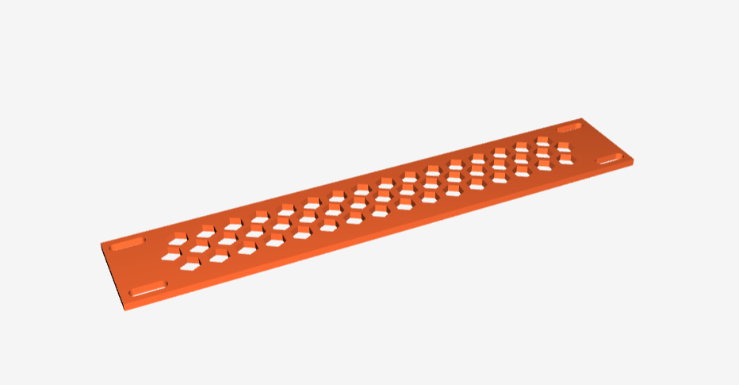
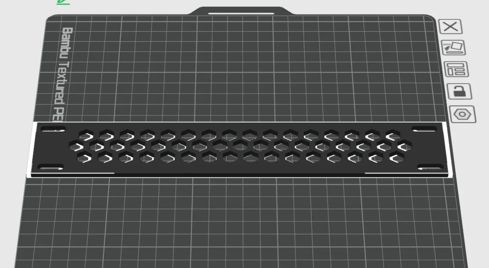
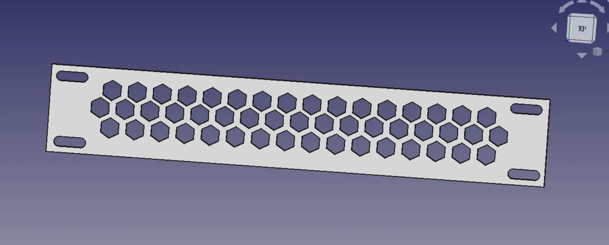

# DeskPi Rackmate series 

# For T0/T1/T2 

##  10-Inch 1U Blank panel

### Description

Since I have limited devices, I needed to fill the empty space with a 1U blank plate. 
It was a practical solution that worked well for me. 

### Gallery 

 

|  |  |  |
|:---:|:---:|:---:|
|  |  |  |

### Printer information and parameters

* 3D Printer: Bambo P1S 0.4 nozzle 
* Material: PLA Basic
* Color: Black

* 3mf file Download: [10inch-1U-TP-LINK-TL-SF1008-Switch-Plate_For_DeskPi_RackMate_Series.3mf](./assets/10inch-1U-TP-LINK-TL-SF1008-Switch-Plate_For_DeskPi_RackMate_Series-New.3mf)
* FreeCAD File Download: [10inch-1U-TP-LINK-TL-SF1008-Switch-Plate_For_DeskPi_RackMate_Series.FCStd](./assets/10inch-1U-TP-LINK-TL-SF1008-Switch-Plate_For_DeskPi_RackMate_Series.FCStd)

----

<button id="like-button-1" class="like-button" onclick="incrementLikes(1)">👍 Like</button>
0

----

