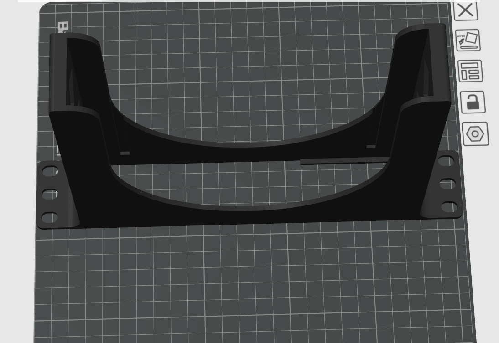
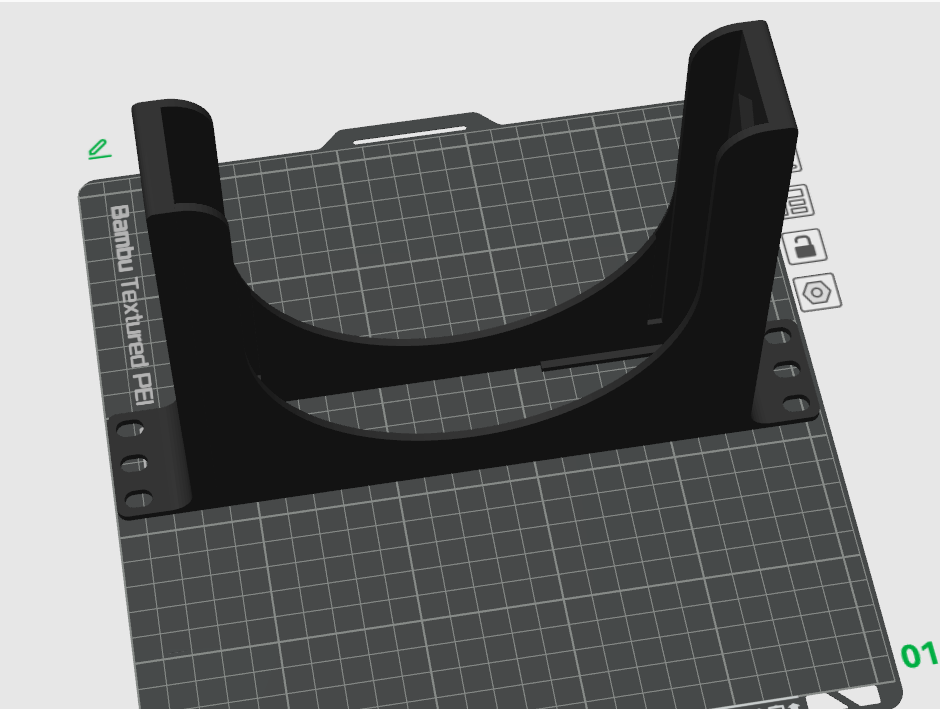
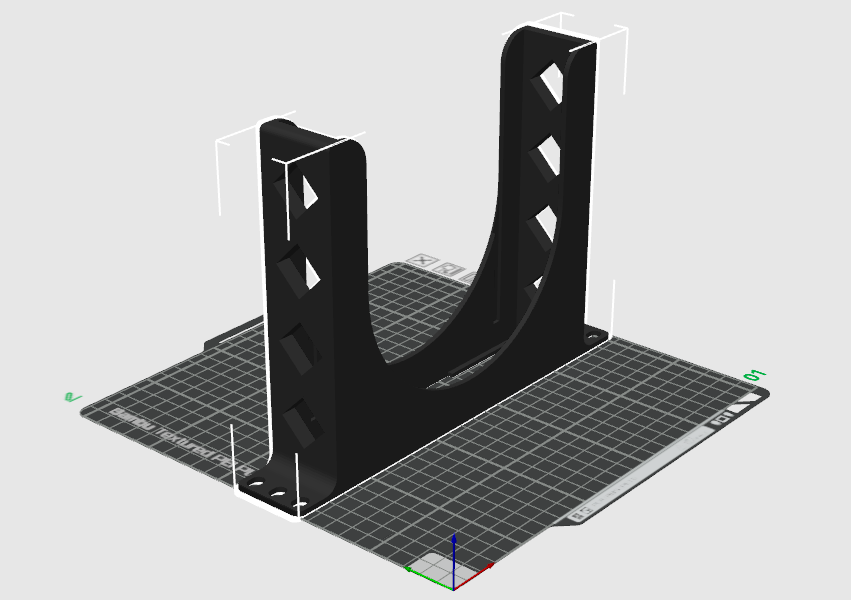

# DeskPi Rackmate series 

# For T0/T1/T2 

## 10-inch 1U rackmount 

### Description

Rackmount for Dell Optiplex 7060, 10-inch rackmount 

### Gallery 

|  |  |  | 
|:---:|:---:|:---:|
|  |  |  |

### Printer information and parameters

* 3D Printer: Bambo P1S 0.4 nozzle 
* Material: PLA Basic
* Color: Black

* STL file download: [Dell-Optiplex-7060_10-inch-rackmount.stl](./assets/Dell-Optiplex-7060_10-inch-rackmount.stl)
* 3mf file download: [Dell-Optiplex-7060_10-inch-rackmount.3mf](./assets/Dell-Optiplex-7060_10-inch-rackmount.3mf)

----

<button id="like-button-2" class="like-button" onclick="incrementLikes(2)">👍 Like</button>
0

----

