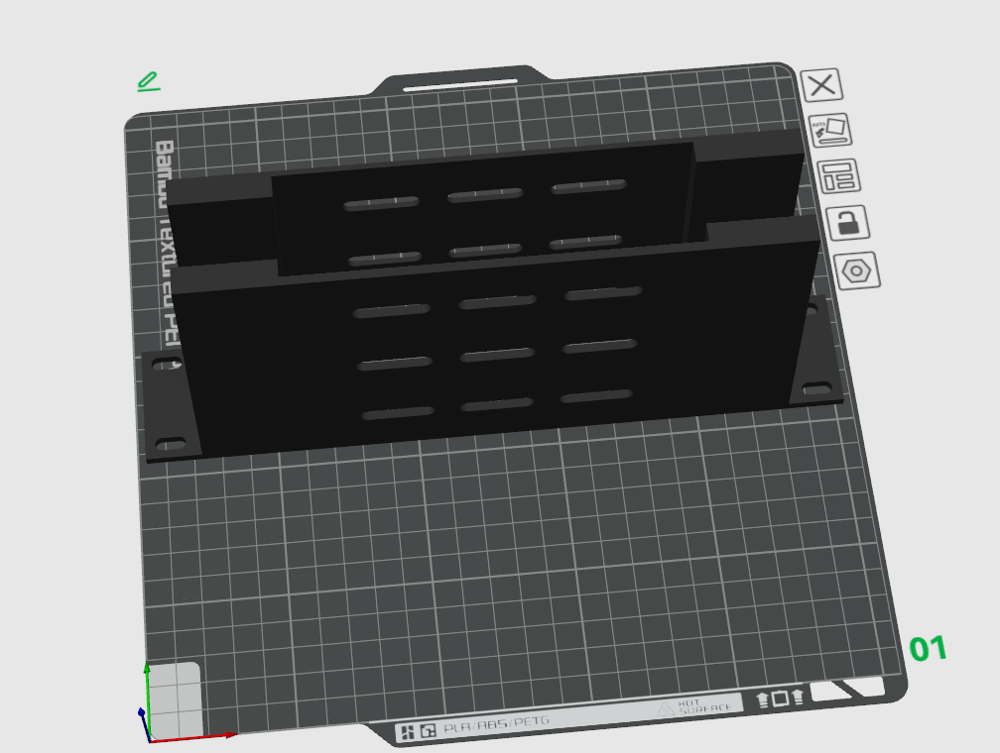
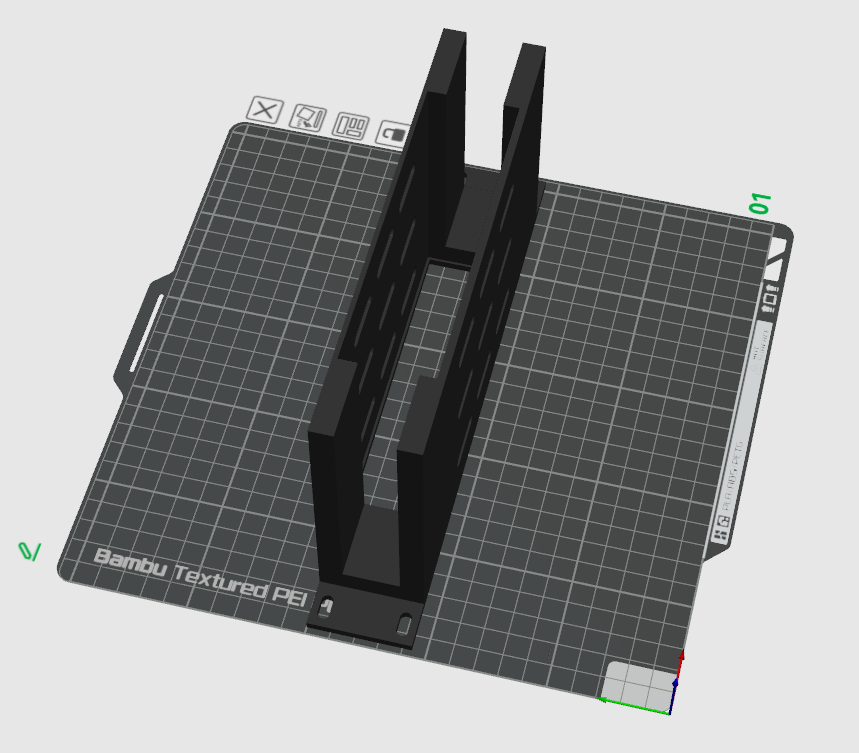
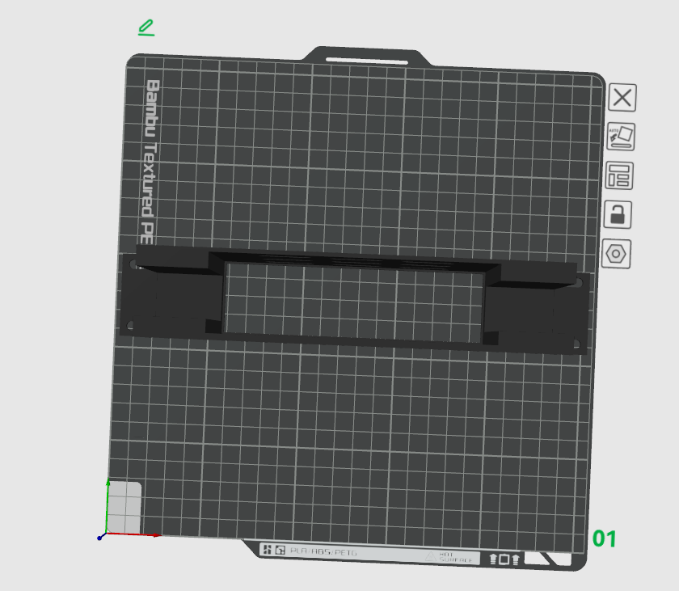

# DeskPi Rackmate series 

# For T0/T1/T2 

## 10-inch 1U  Rack Plate

### Description

TP-Link TL-SF1008 industrial switch rack plate.
* 10-inch 1U Rack Plate 
* Compatiable with DeskPi Rackmate series: T0/T1/T2 
* Good Heat dissipation
* Easy to assemble 
* Wire slot opened on both sides. 
* Version: V0.2 

### Gallery 

### Printer information and parameters

* 3D Printer: Bambo P1S 0.4 nozzle 
* Material: PLA Basic
* Color: Black

 

* 3mf file download: [10inch-1U-TP-LINK-TL-SF1008-Switch-Plate_For_DeskPi_RackMate_Series-New.3mf](./assets/10inch-1U-TP-LINK-TL-SF1008-Switch-Plate_For_DeskPi_RackMate_Series-New.3mf)
* FreeCAD file download: [10inch-1U-TP-LINK-TL-SF1008-Switch-Plate_For_DeskPi_RackMate_Series.FCStd](./assets/10inch-1U-TP-LINK-TL-SF1008-Switch-Plate_For_DeskPi_RackMate_Series.FCStd)

----

<button id="like-button-3" class="like-button" onclick="incrementLikes(3)">👍 Like</button>
0

----

